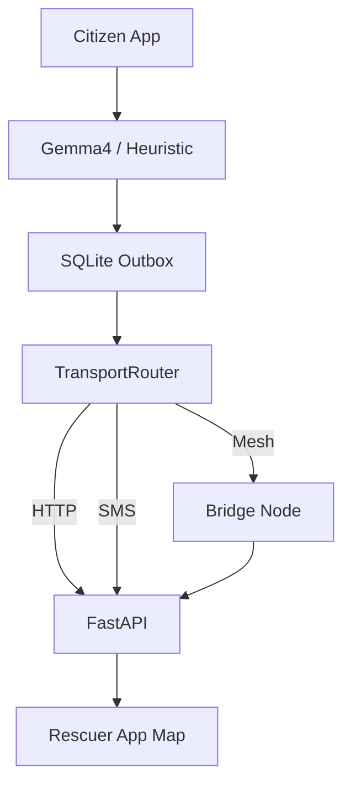

# Architecture Index

Phase 1 design is fully documented via ADRs:

1. [Flutter](adr/001-flutter.md)
2. [FastAPI + PostGIS](adr/002-fastapi-postgis.md)
3. [Gemma 4 local](adr/003-gemma4-local.md)
4. [Offline-first](adr/004-offline-first.md)
5. [Transport router](adr/005-transport-router.md)
6. [Two apps](adr/006-two-apps.md)
7. [AI recommendation only](adr/007-ai-recommendation-only.md)
8. [Android-first](adr/008-android-first.md)

## Data flow (summary)

